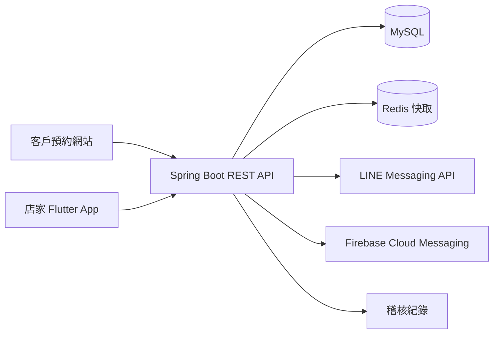
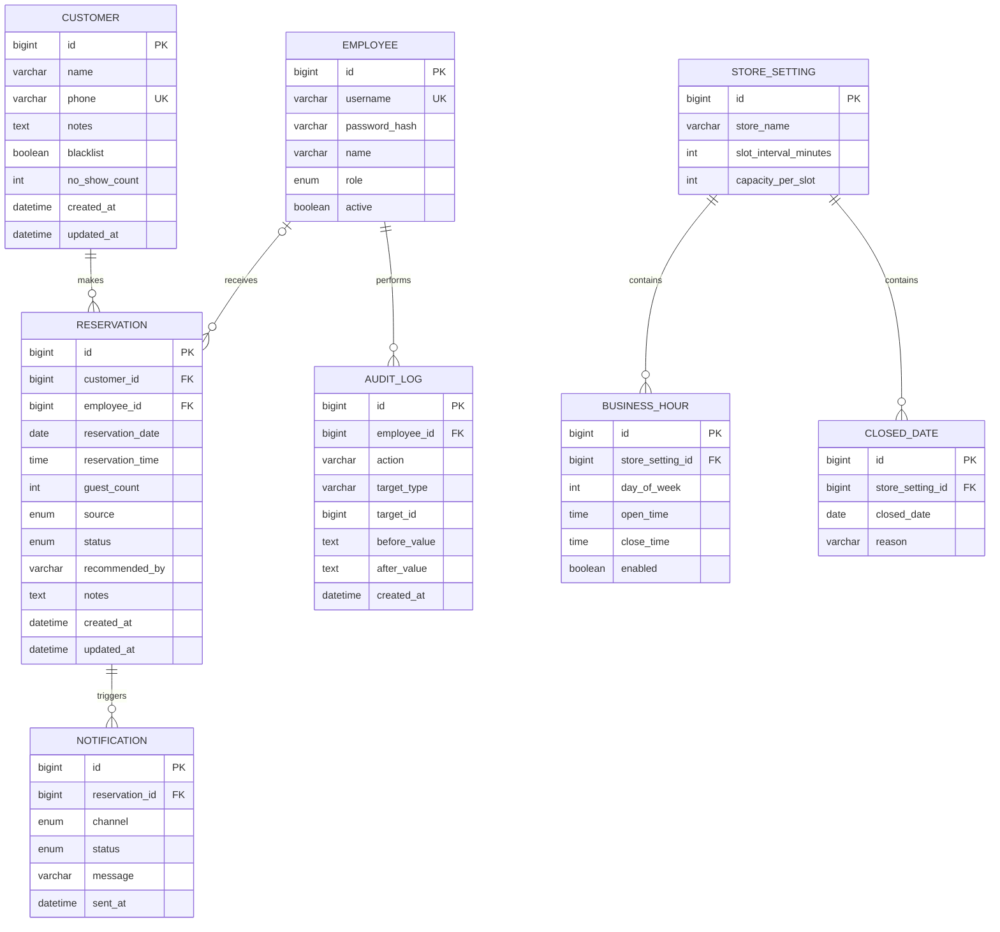

# 智慧店家預約管理系統：系統設計

## 1. 架構

- 客戶端：公開預約頁面，可從官方網站、Google Maps、Instagram、LINE 或 QR Code 進入。
- 店家端：Flutter App，透過 JWT 登入，依角色取得操作權限。
- 後端：Spring Boot 提供 REST API；預約建立後同步建立／更新會員並產生通知與稽核紀錄。
- 資料層：MySQL 作為正式資料來源；Redis 用於電話搜尋與可用時段快取。

## 2. 資料模型（ERD）

## 3. 核心規則

- 客戶電話為會員唯一鍵；首次預約自動建立會員，後續以電話帶入姓名與歷史紀錄。
- 預約來源：`WEBSITE`、`GOOGLE_MAPS`、`INSTAGRAM`、`LINE`、`WALK_IN`、`PHONE`。
- 預約狀態：`PENDING`、`CONFIRMED`、`COMPLETED`、`CANCELLED`、`NO_SHOW`。
- 同一時段的已確認／待確認人數不得超過店家設定的額度。
- `NO_SHOW` 會遞增會員的未到店次數；取消和刪除均需留下稽核紀錄。刪除採軟刪除或以稽核紀錄保留快照。

## 4. API v1

| 區域 | 方法與路徑 | 用途 | 權限 |
|---|---|---|---|
| 公開預約 | `GET /api/public/availability` | 查詢可預約時段 | 公開 |
| 公開預約 | `POST /api/public/reservations` | 建立線上預約 | 公開 |
| 公開預約 | `GET /api/public/reservations/{token}` | 查看預約 | 預約連結 |
| 公開預約 | `PATCH /api/public/reservations/{token}` | 修改或取消預約 | 預約連結 |
| 驗證 | `POST /api/auth/login` | 員工登入 | 公開 |
| 驗證 | `POST /api/auth/refresh` | 更新 JWT | 已登入 |
| 預約 | `GET /api/reservations` | 列表、日期／姓名／電話篩選 | 已登入 |
| 預約 | `POST /api/reservations` | 店家手動新增 | 已登入 |
| 預約 | `PATCH /api/reservations/{id}` | 修改資料 | 具修改權限 |
| 預約 | `PATCH /api/reservations/{id}/status` | 更新狀態 | 具修改權限 |
| 會員 | `GET /api/customers/by-phone/{phone}` | 電話快速查詢 | 已登入 |
| 會員 | `PATCH /api/customers/{id}` | 更新備註／黑名單 | 主管以上 |
| 員工 | `GET/POST/PATCH /api/employees` | 員工帳號與角色 | 老闆 |
| 設定 | `GET/PATCH /api/store-settings` | 時段、額度、休假設定 | 主管以上 |
| 通知 | `POST /api/reservations/{id}/notifications` | 發送 LINE／推播 | 已登入 |
| 報表 | `GET /api/statistics?period=today` | 今日／本週／本月報表 | 已登入 |
| 稽核 | `GET /api/audit-logs` | 操作紀錄查詢 | 主管以上 |

## 5. 權限矩陣

| 動作 | 老闆 | 主管 | 正職 | 工讀生 |
|---|---:|---:|---:|---:|
| 查看預約、會員與報表 | ✓ | ✓ | ✓ | ✓ |
| 建立、修改預約 | ✓ | ✓ | ✓ | 依店家設定 |
| 刪除預約 | ✓ | ✓ | － | － |
| 匯出資料 | ✓ | ✓ | 依店家設定 | － |
| 管理員工與店家設定 | ✓ | － | － | － |
